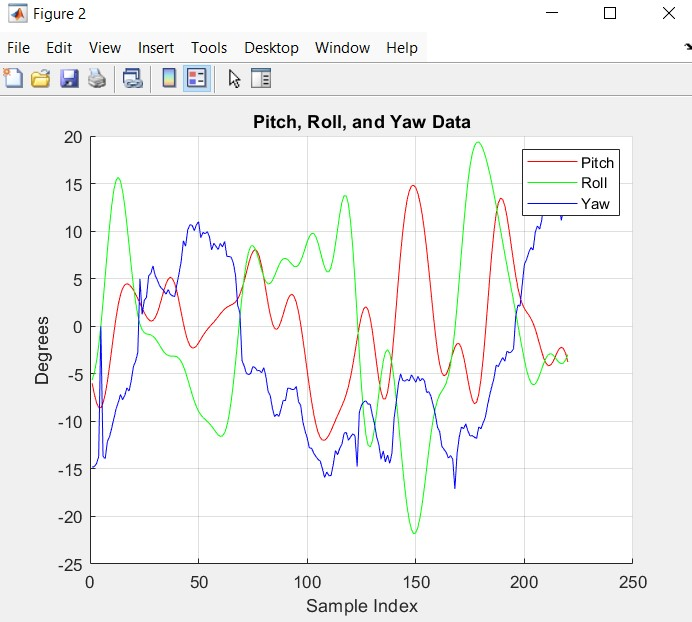

Ocean wave simulation (sea state 3) which uses the gradient to simulate a naval vessels roll, yaw, pitch and wave height data at a specific point (10hz sample rate).

The simulated vibration is fed into a PID control scheme to estimate angular motor speed feedback in all 3 axes of rotation. 
This loop drives a stablization algorithm for an X band radar mounted antenna.

