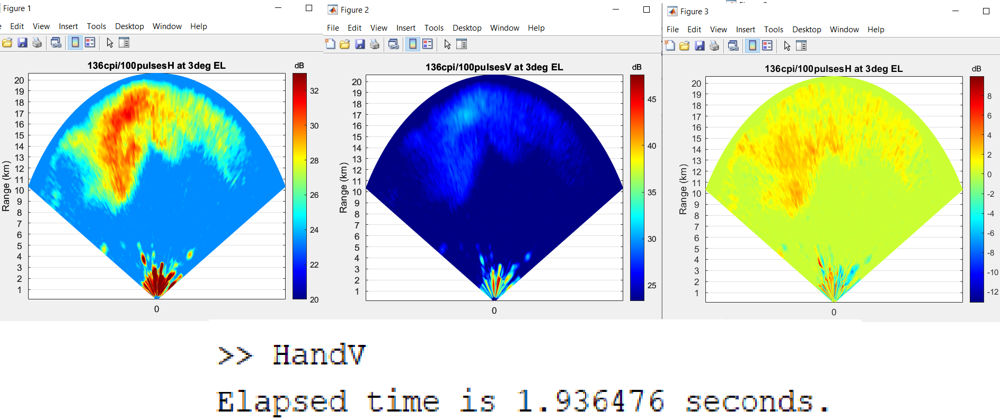

Real time Matlab programming for future real-time data processing of Paradox (Garmin gsx-70) scans.
Aiming to become certified RTOS (~2 seconds)
Plots horizontal (H) and vertical (V) data from a dual pol scan, given an input of raw I/Q.
Conducts H and V pulse integration (100 pulses), dB calculation, and fft to velocity

