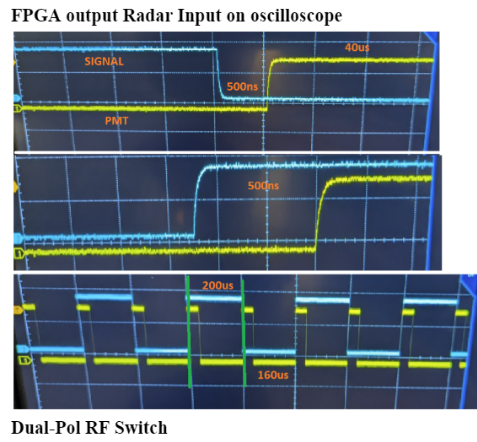

Toggle switch (high/low) to alternate a dual pol radars H and V polarity using a Cmod FPGA.
 

Configurable:
Pulse Repetition Time (PRT)          EX: 200us
Pulse Length                         EX: 40us
High/Low Switch Delay Before Pulse   EX: 500ns

CPI Counter and Length (coherent processing interval)
cpi = set to manage 100 radar pulses (99 200us length 1 250us length) 